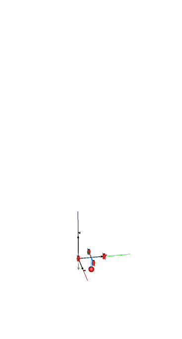
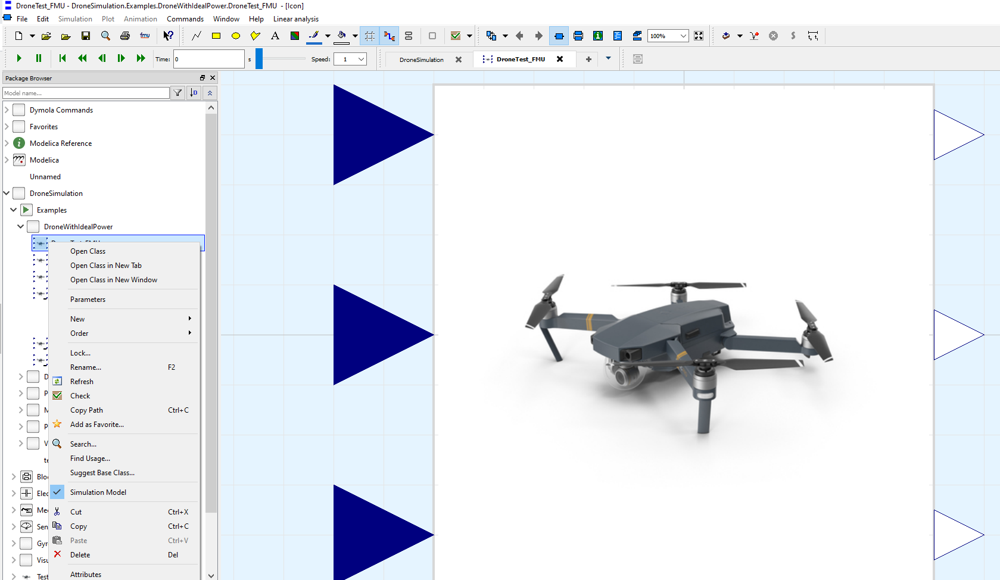

[](https://zenodo.org/badge/latestdoi/176610570)

# DroneLibrary: Multi-Domain Drone Modeling in Modelica
## Scope & Goals
What started as a course project for drone control modeling, has become a larger project on multi-domain modeling for drones.
### Scope
We are hoping to continue to develop it as a Drone library, with the ability of modeling multiple domains (e.g. electrical power supply and management, thermal management, VR-based visualization, control modeling with different approaches - continuous, discrete, synchronous - etc.).
### Goals
- To further enhance the models from different domains, with main modeling focus is on the electrical power and controls.
- To validate the model against a real prototype. We have procured an [FFT Gyro](https://eurekadynamics.com/fft-gyro/) platform to validate the models against a real prototype under controlled conditions.
- To establish sponsored research collaborations with funding bodies and private industry in the field. Please contact: luigi.vanfretti@gmail.com

### Please cite our work!
If you use these resources, please cite the repository via the DOI: [](https://zenodo.org/badge/latestdoi/176610570)

We have submitted a paper to the [15th International Modelica Conference](https://2023.international.conference.modelica.org/) , which we would welcome you to cite as:

> M. Podlaski, L. Vanfretti and D. Winkler, "DroneLibrary: Multi-Domain Drone Modeling in Modelica," submitted to the [15th International Modelica Conference](https://2023.international.conference.modelica.org/), Aachen, Germany, October 9-11, 2023.

A copy of the submitted paper can be found in this repository, [here](F_Papers/Drone_Library.pdf).

Previous work leading to the library has been published and can also be cited as:
> M. Podlaski, L. Vanfretti, H. Nademi and H. Chang, "UAV Dynamic System Modeling and Visualization using Modelica and FMI," The Vertical Flight Society's 76th Annual Forum & Technology Display, Virginia Beach Convention Center on Oct. 6-8, 2020.

A copy of this paper can be found in this repository, [here](F_Papers/CP174_Drone_Modelica_and_FMI.pdf).

### Development
Originally, the repository only included a drone model with 3D visualization (enabled by the Multi Body Library) and FMU export configuration developed using Modelica by Hao Chang and Luigi Vanfretti.

Today, the development of the DroneLibrary is coordinated by [Prof. Luigi Vanfretti](https://github.com/lvanfretti), and we have received contributions from students at Rensselaer Polytechnic Institute involved in the Undergraduate Research Program and the course "Modeling and Simulation for Cyber-Physical Systems". Thank you to all that contribute to this fun and exciting effort!


### Acknowledgement
This work was funded in whole or part by by the National Aeronautics and Space Administration through the University Leadership Initiative award for the Center for Cryogenic High-Efficiency Electrical Technologies for Aircraft (CHEETA). The first author was supported by Rensselaer Polytechnic Institute through the Rensselaer Graduate Fellowship
2019-2020.

# Contents

## A. Modelica Model

All sub-systems and simulation cases are contained within the `./A_Modelica/DroneLibrary` package. Each model is saved individually as its own file. The full version of the [DLR Visualization](https://visualization.ltx.de/) library is required to run any of the models using VR in the `DroneLibrary.Visualization` package.

How to simulate it?

1. Open `./A_Modelica/DroneLibrary/package.mo`
2. The package structure is set up with the following sub-packages:
    - User's Guide
	- Examples
	- Blocks
	- Electrical
	- Mechanical
	- Sensors
	- Visualization
	- Tests
3. Under the Examples/DroneWithIdealPowerSystem package, open the model `TestSystem.mo` and select it as `Simulation model`. This has inputs that act as change in x, y, z coordinates of the drone and outputs x, y, z from the pseudo-GPS modeled within.
4. Go to simulation tab of your tool and change the simulation time to 10s then click simulate button.
5. This simulation should result with the z-coordinate approaching 5 meters, and the other coordinates (x,y) should be around zero. To verify, plot the variables `.xgps`, `.ygps` and `.zgps` of the model by running the Modelica script `drone_simulation_setup.mos`. You should obtain the result below.<br>


6. Within Dymola, run the script `drone_animation_setup.mos`, and then click on the `Play` button to see the animation. The red arrows indicate the force of the propellers.<br>


To switch between different model variants, they can be changed by using the 'change class' method by following the steps in the figure below:


## B. FMU
### Using the distributed FMU
- Within `./B_FMI/` an FMU generated by Dymola 2019 FD01 (64-bit) with both ME and CS (using Cvode) options are included.
Note that this model requires a Dymola license to execute in your local machine to run.

### Generating the FMU under Dymola 2019 FD01 (64-bit)
It is possible to generate an FMU from the Modelica model to provide inputs to x, y and z coordinate changes.
Under the 'Test' sub-package, the `controlModuleTest_fmu_inputs` model can be used. To generate the FMU using Dymola 2019 FD01 (64-bit) under Windows 10, follow the next steps:

1. Open `./A_Modelica/DroneLibrary/package.mo`
2. Set as `Simulation model` the model under `DroneLibrary.Examples.DroneWithIdealPowerSystem.DroneTests_FMU`

	

3. Go to the `Simulation Setup` menu `Simulation>Setup...` and provide the following configurations in the different tabs shown below:

	

	

4. Under the `Simulation` mode, go to the menu `Simulation>Translate>FMU`, and provide the following settings on the `Export FMU` window:<br>
  <br>
  Alternatively, issue the following command under the `Commands` window of Dymola:
```
translateModelFMU("DroneLibrary.Tests.controlModuleTest_fmu_inputs", false, "", "2", "all", false, 1);
```

## D. Model Visualization and VR
To take advantage of this feature you need the [DLR Visualization](https://visualization.ltx.de/)
1. Open the models for visualization under `DroneLibrary.Examples.Visualization.ModuleTest_SimVis` and select it as `Simulation model`.
2. Go to simulation tab of your tool and change the simulation time to 100s then click simulate button.
3. A window for the DLR SimVis application will open with the drone flying in a desert terrain, see below. The drone can be controlled by the keyboard by default, but it can be reconfigured to control the drone with a joystick.


## Contributing
- Via pull requests.

## Copyright
&copy; Meaghan Podlaski, Hao Chang and Luigi Vanfretti, Rensselaer Polytechnic Institute, Troy, NY. Dietmar Winkler, University of South-Eastern Norway, Porsgrunn, Norway.

Licensed under the BSD 3-Clause License.